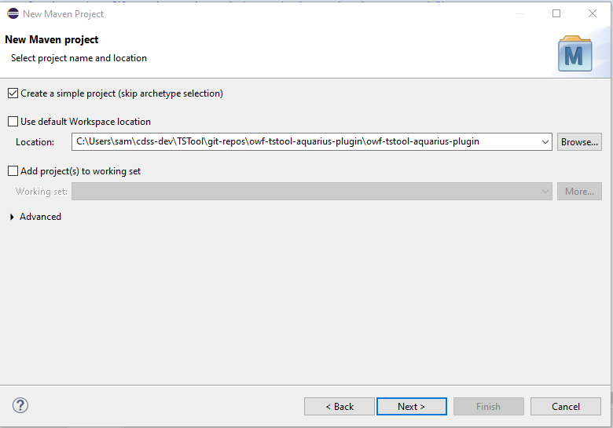

# Setting up the Aquarius Plugin

This documentation explains how to initialize the TSTool Aquarius plugin Eclipse project.
This is typically only done once during initial setup,
and then the repository can be added to the TSTool Eclipse workspace using the instructions in the
main repository [`README.md`](../README.md) file.

## Initialize the Repository ##

Create the GitHub public repository `owf-tstool-aquarius-plugin`.
Note that there are multiple Git management systems available.
This plugin is specific to the Aquarius API.
The [Aquatics Informatics](https://aquaticinformatics.com/) company, which provides Aquarius, also has other products and APIs.

Clone to the `TSTool/git-repos` folder on the computer.

Copy the `README.md`, `.gitignore`, `.gitattributes`, and `build-util/` files from the `owf-tstool-campbellcloud-plugin` repository.
Update the `README.md` and `build-util/` files to replace Campbell Cloud/`campbellcloud` references with Aquarius/`aquarius` references.

## Add Maven Project to Eclipse ##

Start the TSTool Eclipse environment by running the `cdss-app-tstool-main/build-util/run-eclipse-win64.cmd` command file
from a Windows command shell.

Use the Eclipse ***File / New / Project... / Maven / Maven Project***.  Specify information as shown in the following image.
Redundant `owf-tstool-aquarius-plugin` folders are used, one for the Git repository folder working files,
and one for the Maven project with source files.
Create the new folder using the selector dialog if it does not exist.
This allows other top-level folders to be created in the repository to separate major development files, including documentation and tests.

Press ***Next >***.  Fill out the new maven project artifact properties as follows.
Note that currently the plugin is not published in Maven Central or another repository and therefore only minimal information is needed.

Press ***Finish***.

The project will be shown in Eclipse and folders and files will be initialized for the Maven project.

Next, copy files from other similar plugins to implement the required functionality.
The `build-util` scripts can be used to create the plugin `jar` file and run the plugin during development.

After adding the project:

*   Edit the ***Java Build Path***:
    +   Add to the ***Projects / Classpath*** the `cdss-lib-common-java` and `cdss-lib-processor-ts-java` projects.
        This allows required library code to be found.
    +   Add to the ***Libraries / Classpath*** the jar files from the `cdss-lib-common-java/lib/Jackson` folder.
        These files are used to process JSON from web services.
