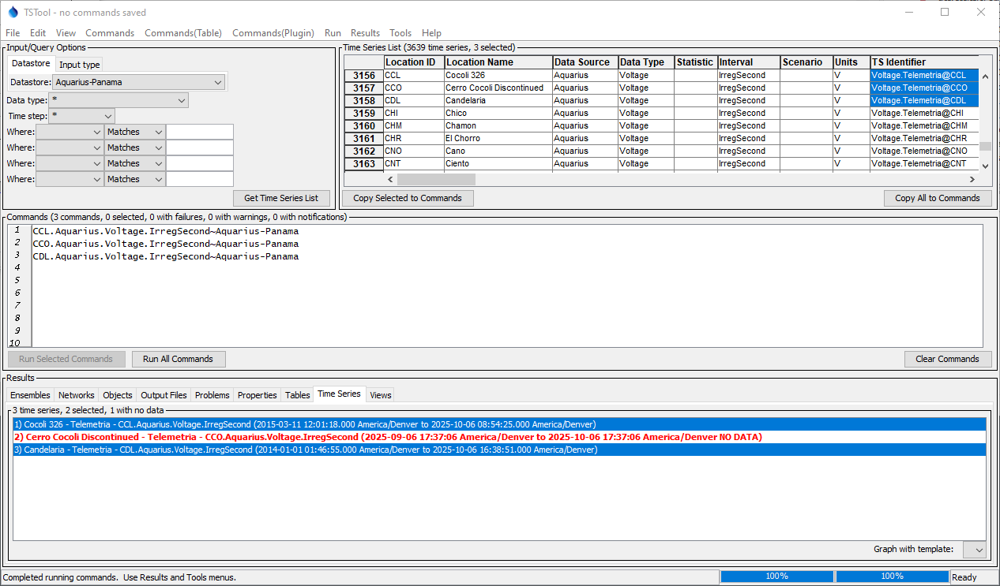
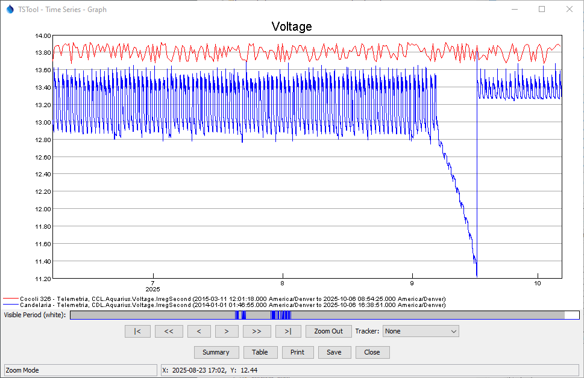

# TSTool Aquarius Plugin / Introduction #

*   [Introduction](#introduction)
*   [TSTool use with Aquarius Web Services](#tstool-use-with-aquarius-web-services)

----------------------

## Introduction ##

TSTool is a powerful software tool that automates time series processing and product generation.
It was originally developed for the State of Colorado to process data for river basin modeling and has since
been enhanced to work with many data sources including:

*   United States Geological Survey (USGS) web service and file formats
*   Natural Resources Conservation Service (NRCS) web services
*   Regional Climate Center (RCC) Applied Climate Information Service (ACIS) web services
*   US Army Corps of Engineers DSS data files
*   others

TSTool is maintained by the Open Water Foundation,
which also enhances the software based on project needs.

*   See the latest [TSTool Documentation](https://opencdss.state.co.us/tstool/latest/doc-user/) to learn about core TSTool features.
*   See the [TSTool Download website](https://opencdss.state.co.us/tstool/) for the most recent software versions and documentation.
*   See the [TSTool Aquarius Plugin download page](https://software.openwaterfoundation.org/tstool-aquarius-plugin/).

## TSTool use with Aquarius Web Services ##

Aquarius web services provide access to data that are maintained in the Aquarius system.
See the following resources:

*   [AQUARIUS Acquisition API Reference Guide](https://panama.aquaticinformatics.net/AQUARIUS/Acquisition/v2/docs/reference.html) - to load data
*   [AQUARIUS Publish API Reference Guide](https://panama.aquaticinformatics.net/AQUARIUS/Publish/v2/docs/reference.html) - to read data

The [Aquarius Web Services datastore documentation](../datastore-ref/Aquarius/Aquarius.md) describes how TSTool integrates with Aquarius.

The [`ReadAquarius`](../command-ref/ReadAquarius/ReadAquarius.md) command can be used to read time series,
in addition to [time series identifier](../command-ref/TSID/TSID.md) commands that are generated from the main TSTool interface.

See the following examples showing how to query voltage time series and the resulting time series graph.

**

**

**

TSTool Main Interface (<a href="../tstool-main.png">see full-size image)</a>

**

**

**

**

TSTool Graph (<a href="../tstool-graph.png">see full-size image)</a>

**
